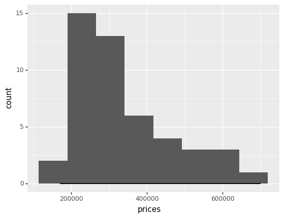
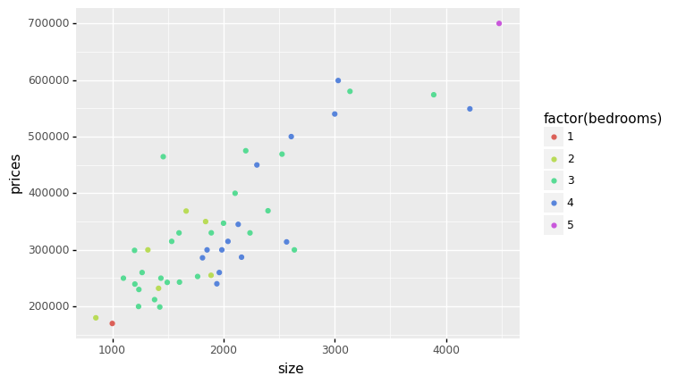
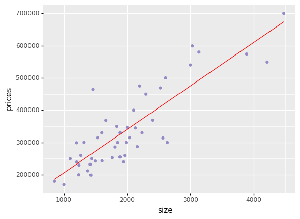
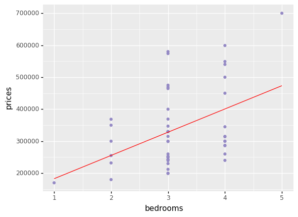
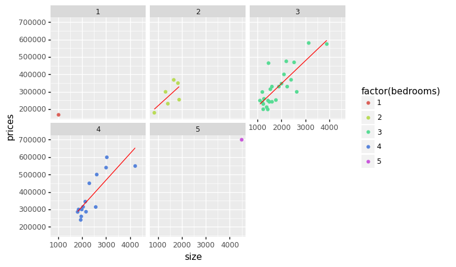

# PortlandOregonHousePricesPrediction

```python
# Ignore warning message
import warnings
warnings.filterwarnings('ignore')
```


```python
import pandas as pd 
import plotnine as pl # for ploting
```


```python
# Linear Regression Machine learning algorithm
from sklearn.linear_model import LinearRegression as LR
```


```python
def predicted_line(X, y):
    _model = LR()
    _model.fit(X, y)
    return X.flatten() * _model.coef_[0] + _model.intercept_
```


```python
# Read dataset
with open("./ex1data2.txt") as _f:
    data = [list(map(int, i.strip().split(','))) for i in _f.readlines()]
```


```python
# Create DataFrame
df = pd.DataFrame(data, columns=["size", "bedrooms", "prices"], )
```


```python
# Average area and price by number of bedrooms
(
    df
    .groupby("bedrooms")["prices"]
    .agg(["mean", "size"])
    .rename(columns={"size": "count", "mean": "avg prices"})
)
```


<div>
<table border="1" class="dataframe">
  <thead>
    <tr style="text-align: right;">
      <th></th>
      <th>avg prices</th>
      <th>count</th>
    </tr>
    <tr>
      <th>bedrooms</th>
      <th></th>
      <th></th>
    </tr>
  </thead>
  <tbody>
    <tr>
      <th>1</th>
      <td>169900.000000</td>
      <td>1</td>
    </tr>
    <tr>
      <th>2</th>
      <td>280866.666667</td>
      <td>6</td>
    </tr>
    <tr>
      <th>3</th>
      <td>326403.920000</td>
      <td>25</td>
    </tr>
    <tr>
      <th>4</th>
      <td>377449.785714</td>
      <td>14</td>
    </tr>
    <tr>
      <th>5</th>
      <td>699900.000000</td>
      <td>1</td>
    </tr>
  </tbody>
</table>
</div>


```python
(
    pl.ggplot(df, pl.aes("prices"))
    + pl.geom_histogram()
    + pl.geom_density()
)
```


    

    


    <ggplot: (8773500822245)>


```python
(
    pl.ggplot(df)
    + pl.geom_point(pl.aes("size", "prices",
                           color="factor(bedrooms)"))
)
```


    

    


    <ggplot: (8773501033671)>


## LR - size vs prices


```python
X = df["size"].values.reshape(-1,1)
y = df["prices"].values
```


```python
# Predicted values
df["predicted_price_by_size"] = predicted_line(X, y)
```


```python
(
    pl.ggplot(df)
    + pl.geom_point(pl.aes("size", "prices"), color="#958AC5")
    + pl.geom_line(pl.aes("size", "predicted_price_by_size"), color="red")
)
```


    

    


    <ggplot: (8773505392625)>


## **LR - number of bedrooms vs prices**


```python
X = df["bedrooms"].values.reshape(-1,1)
y = df["prices"].values
```


```python
# Predicted values
df["predicted_price_by_bedrooms"] = predicted_line(X, y)
```


```python
(
    pl.ggplot(df)
    + pl.geom_point(pl.aes("bedrooms", "prices"), color="#958AC5")
    + pl.geom_line(pl.aes("bedrooms", "predicted_price_by_bedrooms"), color="red")
)
```


    

    


    <ggplot: (8773503059535)>


## **Separate LR model for each number of bedrooms data**


```python
df["predicted_by_bedrooms"] = 0
```


```python
for v in df.groupby("bedrooms").groups.values():
    _df = df.iloc[v]
    _X, _y = _df["size"].values.reshape(-1, 1), _df["prices"].values
    df["predicted_by_bedrooms"].loc[v] = predicted_line(_X, _y)
```

**Regression Line for each number of bedrooms data**


```python
(
    pl.ggplot(df)
    + pl.geom_point(pl.aes("size", "prices", color='factor(bedrooms)'))
    + pl.geom_line(pl.aes("size", "predicted_by_bedrooms"), color="red")
    + pl.facet_wrap("bedrooms")
)
```


    

    


    <ggplot: (8773503002853)>


```python

```
